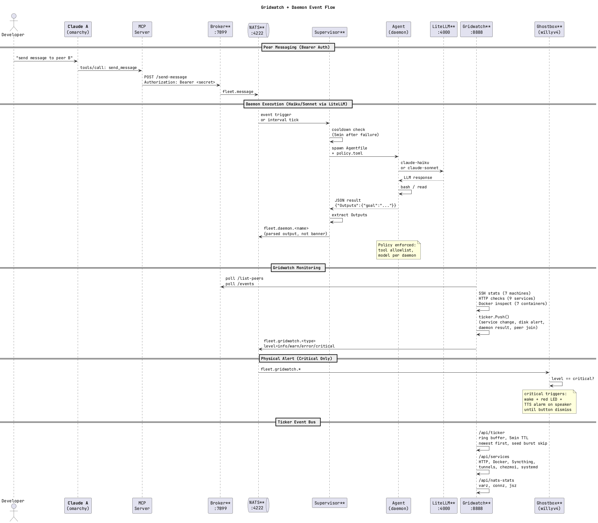

# claude-peers

Cross-machine peer discovery, real-time messaging, fleet monitoring, and AI daemons for Claude Code. Single Go binary, runs on anything.


## What this does

**Your Claude Code instances talk to each other.** Run 5 Claude sessions across 3 machines -- every instance sees every other instance, knows what they're working on, and can send messages that arrive instantly in the recipient's session.

```
  omarchy (pts/9)                    ubuntu-homelab (pts/1)
  ┌───────────────────────┐          ┌──────────────────────┐
  │ Claude A              │          │ Claude B             │
  │ "send a message to    │  ──────> │                      │
  │  peer xyz: what are   │ Tailscale│ ← message arrives   │
  │  you working on?"     │  <────── │   instantly          │
  └───────────────────────┘          └──────────────────────┘
```

On top of that, **AI daemons run autonomously** -- background agents that monitor your fleet, keep PRs mergeable, watch your LLM server, and maintain shared memory across all machines. Powered by [vinayprograms/agent](https://github.com/vinayprograms/agent) and NATS JetStream.

**Gridwatch** is a real-time fleet health dashboard served locally, showing machine stats, services, NATS state, and daemon activity across all your machines.

## Quick start

### 1. Install

```bash
git clone https://github.com/WillyV3/claude-peers-go
cd claude-peers-go
go build -o claude-peers .
```

### 2. Register the MCP server

```bash
claude mcp add -s user claude-peers -- claude-peers server
```

### 3. Enable real-time channel messaging

```bash
# Add to ~/.bashrc or ~/.zshrc
alias claude='claude --dangerously-load-development-channels server:claude-peers'
```

Claude Code must launch with this flag for messages to arrive live in sessions. You'll see a warning on startup -- that's expected. A shell alias survives Claude's auto-updater; wrapper scripts at `~/.local/bin/claude` get overwritten.

### 4. Try it

Open two Claude sessions. In the first:

> List all peers

Claude discovers the other session. Then:

> Send a message to peer [id]: "what are you working on?"

The other Claude receives it immediately.

## Cross-machine setup

```bash
# On the always-on broker machine:
claude-peers init broker
claude-peers broker

# On every other machine:
claude-peers init client http://<broker-tailscale-ip>:7899
```

The broker tracks all peers and routes messages. Clients auto-register when Claude starts.

## CLI

```
claude-peers init <role> [url]   Generate config (broker or client)
claude-peers config              Show current config
claude-peers broker              Start the broker daemon
claude-peers server              Start MCP stdio server (used by Claude Code)
claude-peers status              Show broker status and all peers
claude-peers peers               List all peers
claude-peers send <id> <msg>     Send a message to a peer from CLI
claude-peers dream               Snapshot fleet state to Claude memory
claude-peers dream-watch         Watch fleet via NATS, keep memory continuously fresh
claude-peers supervisor          Run daemon supervisor (manages agent workflows)
claude-peers gridwatch           Start fleet health dashboard (port 8888)
claude-peers kill-broker         Stop the broker daemon
```

## How it works

### Peer messaging

Each Claude Code session spawns an MCP server that registers with the broker. The server polls for inbound messages every second and pushes them as `notifications/claude/channel` -- Claude's experimental protocol for injecting content directly into a session.

When Claude A sends a message to Claude B:
1. A's MCP server POSTs to `/send-message`
2. B's poll loop picks it up via `/poll-messages`
3. B's MCP server writes a channel notification to stdout
4. Claude B sees it appear and responds

### MCP tools

| Tool | Description |
|------|-------------|
| `list_peers` | Discover Claude instances (scope: `all`, `machine`, `directory`, `repo`) |
| `send_message` | Send a message to a peer by ID |
| `set_summary` | Set what you're working on (visible to all peers) |
| `check_messages` | Manual message check (fallback if channel flag isn't active) |

### NATS event bus

The broker dual-writes all events to SQLite (persistence) and NATS JetStream (pub/sub). Everything that happens in the fleet becomes a NATS event:

```
fleet.peer.joined    — Claude instance registered
fleet.peer.left      — Claude instance left
fleet.message        — Message sent between peers
fleet.summary        — Peer updated work summary
fleet.daemon.*       — Daemon run results
fleet.gridwatch.*    — Gridwatch ticker events (service/machine changes)
```

Events are retained for 24h in JetStream. Any component can subscribe to `fleet.>` and react.

### Fleet memory (dream)

`dream-watch` subscribes to NATS and continuously consolidates fleet activity into a Claude memory file at `~/.claude/projects/*/memory/fleet-activity.md`. New Claude sessions on any machine read this and know what happened across the fleet.

```bash
claude-peers dream          # one-shot snapshot
claude-peers dream-watch    # continuous via NATS subscription
```

## Gridwatch

Fleet health dashboard served at `http://localhost:8888`. Run with `claude-peers gridwatch`.

### 4 pages

| Page | Content |
|------|---------|
| **Fleet** | Machine cards -- CPU, memory, disk, top processes, uptime. SSHes to each machine every 5s. |
| **Services** | HTTP health checks, Docker containers (status, uptime, restart count), Cloudflare tunnels, Syncthing folder sync state, chezmoi diff status, failed systemd units. |
| **NATS** | Live JetStream stream/consumer stats, connection list, message rates, recent fleet events, daemon run log. |
| **Agents** | Daemon run history from NATS -- which daemons ran, duration, trigger, outcome. |

### Ticker event bus

A scrolling ticker at the bottom of every page shows real-time events:
- Machine status changes (online/offline/timeout) -- debounced to prevent flapping
- Disk alerts at ≥85%
- Service and Docker status changes
- Sync conflicts
- Failed systemd units
- Daemon completions and failures
- Peer joins/leaves (from NATS)

Ticker events are also published to `fleet.gridwatch.*` on NATS for fleet-wide visibility.

### Configuration

Gridwatch loads from `~/.config/claude-peers/gridwatch.json`:

```json
{
  "port": 8888,
  "machines": [
    {"id": "homelab", "host": "ubuntu-homelab", "os": "linux", "specs": "32GB RAM", "ip": "100.109.211.128"},
    {"id": "omarchy", "host": "", "os": "linux", "specs": "16GB RAM", "ip": "100.85.150.110"},
    {"id": "macbook", "host": "macbook1", "os": "macos", "specs": "M1 Pro", "ip": ""}
  ],
  "llm_url": "http://100.75.170.108:8080",
  "nats_url": "nats://100.109.211.128:4222",
  "nats_monitor_url": "http://100.109.211.128:8222"
}
```

Machines with `"host": ""` are monitored locally (no SSH). Set `"os": "macos"` for macOS machines.

Override config path: `GRIDWATCH_CONFIG=/path/to/file` or `GRIDWATCH_PORT=9999`.

### Service monitor configuration

Service monitoring reads from `~/.config/claude-peers/service-monitor.json`:

```json
{
  "interval": 30,
  "http_checks": [
    {"name": "litellm", "url": "http://100.109.211.128:4000/health", "port": 4000},
    {"name": "broker", "url": "http://100.109.211.128:7899/health", "port": 7899}
  ],
  "docker_host": "ubuntu-homelab",
  "syncthing_url": "http://127.0.0.1:8384",
  "syncthing_key": "your-api-key",
  "syncthing_host": "ubuntu-homelab",
  "sync_folders": ["projects", "hfl-projects"],
  "chezmoi_repo_on": "ubuntu-homelab",
  "tunnels": [
    {"name": "humanfrontiertests", "hostname": "humanfrontiertests.com", "backend": "localhost:3000"}
  ]
}
```

## Daemons



Daemons are AI background processes that maintain your infrastructure without prompting. The supervisor watches for triggers (NATS events or time intervals) and spawns agent workflows using [vinayprograms/agent](https://github.com/vinayprograms/agent).

Each daemon is a directory with 4 files:

```
daemons/fleet-scout/
  daemon.json         # schedule + description
  fleet-scout.agent   # workflow definition (Agentfile DSL)
  agent.toml          # LLM provider config
  policy.toml         # tool allowlist + execution limits
```

### Schedules

| Format | Example | Behavior |
|--------|---------|----------|
| `interval:<duration>` | `interval:15m` | Run on a fixed interval |
| `event:<nats-subject>` | `event:fleet.>` | Trigger on matching NATS event |
| `cron:<expression>` | `cron:0 * * * *` | Run on cron schedule |

### Included daemons

| Daemon | Schedule | What it does |
|--------|----------|-------------|
| **fleet-scout** | Every 15m | Checks broker health, all peers, LLM server. Reports anomalies. |
| **fleet-memory** | On `fleet.>` events | Consolidates fleet activity into shared Claude memory. |
| **llm-watchdog** | Every 15m | Monitors LLM server health, alerts on anomalies. |
| **pr-helper** | Every 30m | Keeps PRs mergeable -- fixes conflicts, lint, stale descriptions. |
| **sync-janitor** | Every 30m | Detects Syncthing conflict files and emails a resolution report. |
| **librarian** | Every 6h | Audits documentation against live fleet state, emails discrepancy report. |

### Running the supervisor

```bash
claude-peers supervisor
```

The supervisor discovers all daemon directories, connects to NATS for event triggers, and manages the lifecycle. Each run is policy-constrained (tool allowlist, max runtime, max tool calls). Failed daemons cool off for 5 minutes before retrying.

Daemon workflows run through LiteLLM, routing to whatever model is configured in the daemon's `agent.toml`.

### Agentfile format

Daemon workflows use the vinay-agent Agentfile DSL:

```
NAME daemon-name

INPUT variable_name DEFAULT "default_value"

AGENT role """System prompt..."""

GOAL goal_name "Description of the goal"
RUN step_name USING goal_name
```

Or the compact form (no separate AGENT block):

```
GOAL goal_name """Multi-line goal description.
Steps to execute..."""

RUN main USING goal_name
```

## Configuration

`~/.config/claude-peers/config.json`:

```json
{
  "role": "client",
  "broker_url": "http://<broker-ip>:7899",
  "machine_name": "my-machine",
  "stale_timeout": 300,
  "nats_url": "nats://<broker-ip>:4222",
  "nats_token": "",
  "daemon_dir": "/path/to/daemons",
  "agent_bin": "/path/to/agent",
  "llm_base_url": "http://<litellm-host>:4000/v1",
  "llm_model": "vertex_ai/claude-sonnet-4-6",
  "secret": ""
}
```

Environment variable overrides:

| Variable | Config key |
|----------|------------|
| `CLAUDE_PEERS_BROKER_URL` | `broker_url` |
| `CLAUDE_PEERS_LISTEN` | `listen` |
| `CLAUDE_PEERS_MACHINE` | `machine_name` |
| `CLAUDE_PEERS_NATS` | `nats_url` |
| `CLAUDE_PEERS_NATS_TOKEN` | `nats_token` |
| `CLAUDE_PEERS_DAEMONS` | `daemon_dir` |
| `AGENT_BIN` | `agent_bin` |
| `CLAUDE_PEERS_LLM_URL` | `llm_base_url` |
| `CLAUDE_PEERS_LLM_MODEL` | `llm_model` |
| `CLAUDE_PEERS_SECRET` | `secret` |

## Broker API

| Endpoint | Method | Description |
|----------|--------|-------------|
| `/health` | GET | Status + peer count + machine name |
| `/register` | POST | Register peer |
| `/heartbeat` | POST | Keep-alive |
| `/list-peers` | POST | List peers by scope (all/machine/directory/repo) |
| `/send-message` | POST | Send message to a peer |
| `/poll-messages` | POST | Get messages + mark delivered |
| `/peek-messages` | POST | Get messages without marking delivered |
| `/set-summary` | POST | Update peer work summary |
| `/events` | GET | Recent broker events (1h retention) |
| `/unregister` | POST | Remove peer |

## Production deployment

All services run as systemd user units on the broker machine:

```bash
systemctl --user enable --now claude-peers-broker
systemctl --user enable --now nats-server
systemctl --user enable --now claude-peers-dream
systemctl --user enable --now claude-peers-supervisor
loginctl enable-linger $USER    # start without login
```

Cross-compile and deploy to the whole fleet:

```bash
go build -o claude-peers .
GOOS=linux GOARCH=amd64 go build -o claude-peers-linux-amd64 .
GOOS=linux GOARCH=arm64 go build -o claude-peers-linux-arm64 .
GOOS=darwin GOARCH=arm64 go build -o claude-peers-darwin-arm64 .

cp deploy.conf.example deploy.conf   # first time only
# edit deploy.conf with your fleet hosts
./deploy.sh
```

## Dependencies

- `modernc.org/sqlite` -- pure Go SQLite (no CGO)
- `github.com/nats-io/nats.go` -- NATS client
- Go stdlib for everything else

Daemons use [vinayprograms/agent](https://github.com/vinayprograms/agent) as an external binary for workflow execution.

## Credits

Go rewrite of [claude-peers-mcp](https://github.com/louislva/claude-peers-mcp) by louislva. Extended with cross-machine networking, real-time channel messaging, NATS pub/sub, fleet memory, gridwatch dashboard, and AI daemons by Claude (Anthropic) and [Willy Van Sickle](https://github.com/WillyV3). Daemon execution powered by [vinayprograms/agent](https://github.com/vinayprograms/agent) and [agentkit](https://github.com/vinayprograms/agentkit).

## License

MIT
