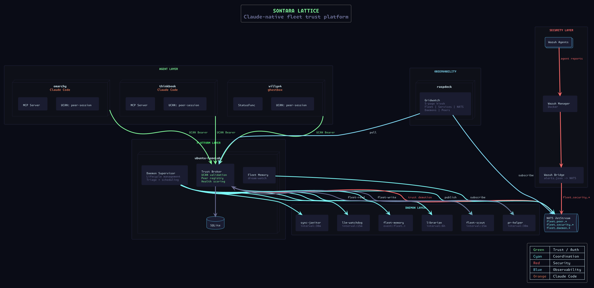
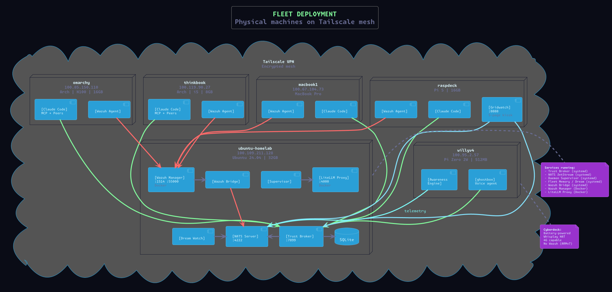
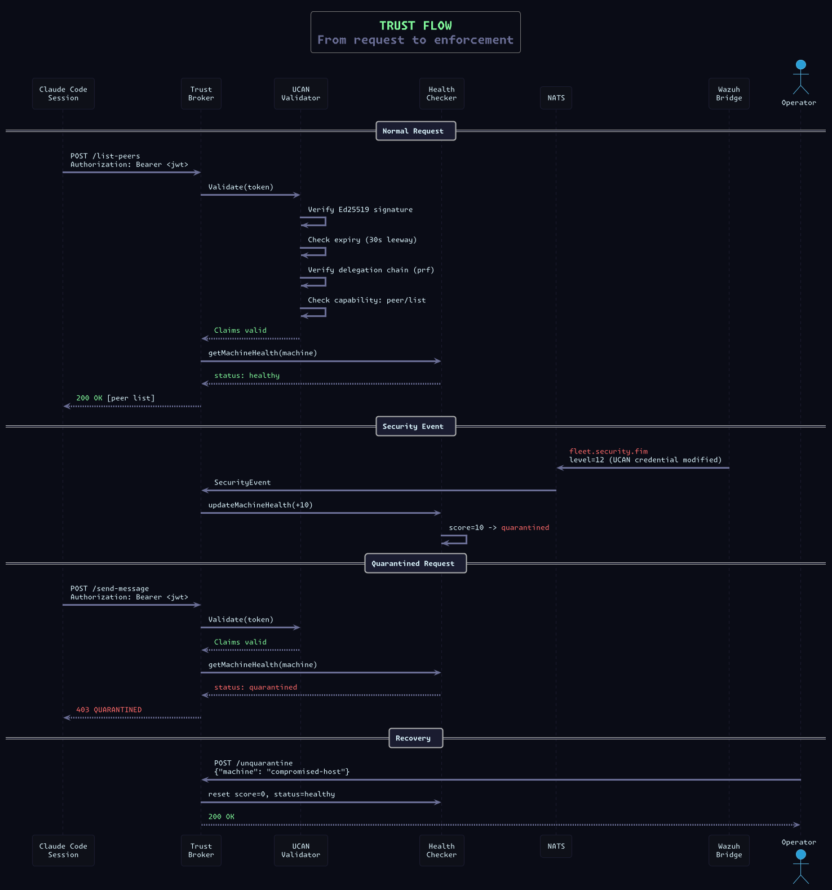

# Sontara Lattice

A Claude-native fleet platform. Run Claude Code sessions and autonomous Claude daemons across physical machines with cryptographic trust, scoped capabilities, continuous security monitoring, and real-time observability. Single Go binary, runs on anything from a Pi Zero to a rack server.

## What this is

Your Claude Code instances talk to each other, run autonomous background daemons, and operate as a trusted fleet. Every session and daemon gets an Ed25519 identity and a capability-scoped token. The trust broker validates every action. Wazuh EDR monitors every endpoint. Compromised machines get quarantined automatically. You see it all on a real-time dashboard.

This is not a framework or a spec. It's running in production on a 7-machine Tailscale mesh with Claude Code sessions coordinating across Arch, Ubuntu, Debian, and macOS -- including a Raspberry Pi cyberdeck that carries the fleet in a backpack.

Built on: **Claude Code** + **UCAN capability tokens** + **NATS JetStream** + **Wazuh EDR** + **Ed25519 identity**

## Architecture







Every participant in the lattice gets:
- **Identity**: Ed25519 keypair (hardware-backed where available -- TPM, Secure Enclave)
- **Capabilities**: UCAN JWT token scoped to exactly the broker endpoints it needs, delegated from a root of trust with attenuation enforcement
- **Policy**: Guardrails on tools, paths, and actions (for daemons)
- **Coordination**: NATS pub/sub for event-driven communication across machines
- **Monitoring**: Wazuh file integrity, auth log analysis, process monitoring
- **Dynamic trust**: Health score degrades on security events -- capabilities get restricted or revoked automatically

## Core Components

### Trust Broker
HTTP API server that manages peer registration, messaging, fleet state, and UCAN token validation. Every request requires a capability-scoped JWT. The broker maintains per-machine health scores and enforces trust demotion.

### UCAN Capability Auth
Ed25519+JWT tokens with embedded capabilities and delegation chains. A root key signs tokens for each machine/service, scoped to exactly the endpoints they need. Child tokens can only have a subset of their parent's capabilities (attenuation). Tokens expire, are cryptographically verifiable without server round-trips, and chain back to a single root of trust.

**Capability resources:**
| Resource | What it gates |
|----------|--------------|
| `peer/register` | Register as a peer |
| `peer/heartbeat` | Keep-alive |
| `peer/list` | Discover other peers |
| `msg/send` | Send messages |
| `msg/poll` | Receive messages |
| `events/read` | Read fleet events |
| `memory/read` | Read fleet memory |
| `memory/write` | Write fleet memory |

**Pre-defined roles:**
| Role | Capabilities |
|------|-------------|
| `peer-session` | Full peer interaction (register, message, list, events) |
| `fleet-read` | Read-only fleet access (list, events, memory read) |
| `fleet-write` | Fleet read + memory write |
| `cli` | List peers, send messages, read events |

### Wazuh EDR Bridge
Tails Wazuh's `alerts.json`, classifies security events by type (file integrity, auth, process, network), and publishes to NATS `fleet.security.*` subjects. The broker subscribes and updates machine health scores:

| Alert Level | Severity | Trust Impact |
|-------------|----------|-------------|
| 1-5 | Info | Log only |
| 6-9 | Warning | Health score +1 |
| 10-12 | Critical | Health score +10, capabilities demoted |
| 13-15 | Quarantine | All capabilities revoked |

Health scores decay over time. Quarantine requires manual recovery.

Custom Wazuh rules detect:
- Claude-peers binary tampering (level 13)
- UCAN credential file modification (level 12)
- SSH key changes (level 10)
- Systemd unit file changes (level 9)

### Daemon Supervisor
Manages autonomous agent workflows. Each daemon is defined by:
- `.agent` file: The agent's prompt and goals (Agentfile DSL)
- `daemon.json`: Schedule (interval, event-triggered, or cron)
- `agent.toml`: LLM provider config
- `policy.toml`: Tool allowlists, path restrictions, safety constraints
- `triage.sh`: Optional gate script (exit 0 = run, exit 1 = skip)

**Built-in daemons:**
| Daemon | Schedule | What it does |
|--------|----------|-------------|
| fleet-scout | 15m | Check health of all machines and services |
| fleet-memory | event:fleet.> | Consolidate fleet activity into shared memory |
| pr-helper | 30m | Keep PRs mergeable across GitHub orgs |
| llm-watchdog | 15m | Monitor LLM server health |
| sync-janitor | 30m | Detect and report Syncthing conflicts |
| librarian | 6h | Audit documentation against live fleet state |

### Gridwatch Dashboard
5-page real-time kiosk dashboard:
1. **Fleet**: Machine tiles with CPU/RAM/disk, live Claude agents, LLM status
2. **Services**: Docker, Syncthing, systemd, Cloudflare tunnel monitoring
3. **NATS**: JetStream stats, connections, consumers, message flow
4. **Agents**: Daemon status cards with run history, sparklines, output
5. **Peers**: Constellation network graph of the agent mesh

Embedded in the binary. Serves on any port. Auto-rotates pages.

### Fleet Memory (Dream)
Consolidates fleet activity into Claude-compatible memory files. Peers fetch fleet state on startup so every Claude session knows what's happening across the mesh. Updated via NATS events or periodic polling.

### Claude Peers (MCP Server)
The foundational layer. Every Claude Code session runs an MCP server that registers with the broker, discovers other sessions across machines, and exchanges messages in real-time via JSON-RPC channel notifications. Sessions auto-generate LLM summaries of their current work. Peers see each other's machine, project, branch, TTY, and summary. Messages arrive instantly -- no polling on the Claude side.

This is what makes Claude Code sessions aware of each other. Everything else in the lattice builds on this.

## Quick Start

### 1. Initialize the broker

On your always-on server:

```bash
sontara-lattice init broker
sontara-lattice broker
```

This generates an Ed25519 root keypair and a self-signed UCAN root token.

### 2. Set up client machines

On each machine:

```bash
sontara-lattice init client http://<broker-ip>:7899
```

Copy `root.pub` from the broker to `~/.config/claude-peers/root.pub` on the client.

### 3. Issue capability tokens

On the broker machine:

```bash
# Issue a peer-session token for a client
sontara-lattice issue-token /path/to/client-identity.pub peer-session

# Issue a fleet-write token for dream/supervisor
sontara-lattice issue-token /path/to/service-identity.pub fleet-write
```

On the client, save the issued token:

```bash
sontara-lattice save-token <jwt>
```

### 4. Start services

```bash
# Broker (handles peer registration, auth, fleet state)
sontara-lattice broker

# MCP server (Claude Code integration, auto-started by Claude)
sontara-lattice server

# Daemon supervisor (manages autonomous agent workflows)
sontara-lattice supervisor

# Fleet memory (consolidates activity into Claude memory)
sontara-lattice dream-watch

# Gridwatch dashboard (real-time fleet observability)
sontara-lattice gridwatch

# Wazuh bridge (security event ingestion from Wazuh EDR)
sontara-lattice wazuh-bridge
```

## CLI Reference

```
sontara-lattice init <role> [url]              Generate config (broker or client)
sontara-lattice config                         Show current config
sontara-lattice broker                         Start the trust broker
sontara-lattice server                         Start MCP stdio server (Claude Code)
sontara-lattice status                         Show broker status and peers
sontara-lattice peers                          List all peers
sontara-lattice send <id> <msg>                Send a message to a peer
sontara-lattice issue-token <pub> <role>       Issue a UCAN capability token
sontara-lattice save-token <jwt>               Save a UCAN token locally
sontara-lattice unquarantine <machine>         Restore a quarantined machine
sontara-lattice dream                          One-shot fleet memory snapshot
sontara-lattice dream-watch                    Continuous fleet memory via NATS
sontara-lattice supervisor                     Run daemon supervisor
sontara-lattice gridwatch                      Start fleet dashboard
sontara-lattice wazuh-bridge                   Bridge Wazuh alerts to NATS
```

## Configuration

Config file: `~/.config/claude-peers/config.json`

```json
{
  "role": "client",
  "broker_url": "http://100.109.211.128:7899",
  "machine_name": "omarchy",
  "nats_token": "nats-...",
  "llm_base_url": "http://100.109.211.128:4000/v1",
  "llm_api_key": "sk-..."
}
```

Key files in `~/.config/claude-peers/`:
| File | Purpose |
|------|---------|
| `config.json` | Runtime configuration |
| `identity.pem` | Ed25519 private key (mode 0600) |
| `identity.pub` | Ed25519 public key |
| `root.pub` | Fleet root public key (from broker) |
| `token.jwt` | UCAN capability token (mode 0600) |

All config fields have environment variable overrides (`CLAUDE_PEERS_*`).

## NATS Subjects

| Subject | Publisher | Content |
|---------|-----------|---------|
| `fleet.peer.joined` | Broker | Peer registration |
| `fleet.peer.left` | Broker | Peer departure |
| `fleet.summary` | Broker | Summary changes |
| `fleet.message` | Broker | Message sent |
| `fleet.security.fim` | Wazuh bridge | File integrity alerts |
| `fleet.security.auth` | Wazuh bridge | Authentication events |
| `fleet.security.process` | Wazuh bridge | Process anomalies |
| `fleet.security.network` | Wazuh bridge | Network anomalies |
| `fleet.security.quarantine` | Wazuh bridge | Quarantine triggers |

## Broker API

All endpoints (except `/health`) require a UCAN Bearer token with the appropriate capability.

| Method | Path | Capability | Description |
|--------|------|-----------|-------------|
| GET | `/health` | (public) | Broker status |
| POST | `/register` | `peer/register` | Register a peer |
| POST | `/heartbeat` | `peer/heartbeat` | Keep-alive |
| POST | `/list-peers` | `peer/list` | Discover peers |
| POST | `/send-message` | `msg/send` | Send a message |
| POST | `/poll-messages` | `msg/poll` | Receive messages |
| POST | `/set-summary` | `peer/set-summary` | Update work summary |
| GET | `/events` | `events/read` | Recent events |
| GET | `/fleet-memory` | `memory/read` | Fleet memory document |
| POST | `/fleet-memory` | `memory/write` | Update fleet memory |
| GET | `/machine-health` | `events/read` | Per-machine health scores |
| POST | `/unquarantine` | `memory/write` | Restore quarantined machine |

## Dependencies

- Go 1.25+
- [NATS Server](https://nats.io/) with JetStream enabled
- [Wazuh](https://wazuh.com/) manager (Docker) + agents on fleet machines
- [vinayprograms/agent](https://github.com/vinayprograms/agent) binary (for daemon supervisor)
- `golang-jwt/jwt/v5` (UCAN tokens)
- `nats-io/nats.go` (NATS client)
- `modernc.org/sqlite` (broker storage)

## Production Deployment

Each component runs as a systemd user service:

```bash
# ~/.config/systemd/user/sontara-broker.service
[Service]
ExecStart=%h/.local/bin/sontara-lattice broker

# ~/.config/systemd/user/sontara-supervisor.service
[Service]
ExecStart=%h/.local/bin/sontara-lattice supervisor
Environment=CLAUDE_PEERS_TOKEN=<jwt>

# ~/.config/systemd/user/sontara-wazuh-bridge.service
[Service]
ExecStart=%h/.local/bin/sontara-lattice wazuh-bridge
Environment=WAZUH_ALERTS_PATH=/path/to/alerts.json
```

## License

Private. Copyright Human Frontier Labs Inc.
